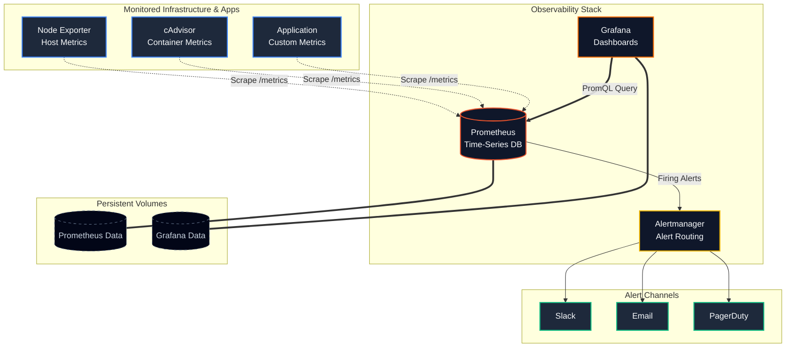

# 📊 Prometheus & Grafana Monitoring Stack

[](https://opensource.org/licenses/MIT)
[](https://prometheus.io/)
[](https://grafana.com/)
[](https://www.docker.com/)

A robust, scalable, and easy-to-deploy monitoring and observability stack using **Prometheus** for metric collection and **Grafana** for rich data visualization. This repository provides a complete, containerized setup to monitor your infrastructure and applications with minimal configuration.

---

## 🏗️ Architecture & Flow

The following diagram illustrates the detailed data flow, storage persistence, and component architecture of this monitoring stack:



## ✨ Features

- **Automated Scraping:** Pre-configured Prometheus targets for common exporters (Node Exporter, cAdvisor).
- **Rich Visualization:** Ready-to-use Grafana dashboards provisioned automatically as code.
- **Alerting:** Integrated Alertmanager setup for proactive incident response and routing.
- **Containerized:** Fully Dockerized setup using `docker-compose` for one-click deployment.
- **Persistent Storage:** Configured Docker volumes to ensure your metrics and dashboards survive container restarts.
- **Network Isolation:** Services communicate securely over a dedicated Docker bridge network.

## 🚀 Getting Started

### Prerequisites

- [Docker](https://docs.docker.com/get-docker/) (v20.10+)
- [Docker Compose](https://docs.docker.com/compose/install/) (v2.0+)

### Installation

1. **Clone the repository:**
   ```bash
   git clone https://github.com/Rupeshbhardwaj002/Promethus-Grafana.git
   cd Promethus-Grafana
   ```

2. **Start the stack:**
   ```bash
   docker-compose up -d
   ```

3. **Verify the services are running:**
   ```bash
   docker-compose ps
   ```

### Accessing the Services

| Service | URL | Default Credentials | Description |
|---------|-----|---------------------|-------------|
| **Grafana** | `http://localhost:3000` | `admin` / `admin` | Visualization UI |
| **Prometheus** | `http://localhost:9090` | - | TSDB & Query Interface |
| **Alertmanager** | `http://localhost:9093` | - | Alert Routing UI |
| **Node Exporter**| `http://localhost:9100/metrics` | - | Host OS Metrics |

*Note: You will be prompted to change the Grafana password upon first login.*

## 📂 Directory Structure

```text
.
├── docker-compose.yml      # Main Docker Compose configuration
├── prometheus/
│   ├── prometheus.yml      # Prometheus scrape configs & rules
│   └── alerts.yml          # Alerting rules definitions
├── grafana/
│   ├── provisioning/       # Automated dashboard & datasource setup
│   │   ├── dashboards/     # Dashboard providers
│   │   └── datasources/    # Prometheus datasource config
│   └── dashboards/         # JSON dashboard templates
└── alertmanager/
    └── alertmanager.yml    # Alert routing and receiver configs
```

## 🛠️ Configuration

### Adding New Targets
To monitor a new service, add it to the `scrape_configs` section in `prometheus/prometheus.yml`:

```yaml
scrape_configs:
  - job_name: 'new_service'
    static_configs:
      - targets: ['new_service:8080']
```
Then, restart Prometheus: `docker-compose restart prometheus`

### Configuring Alerts
Update `alertmanager/alertmanager.yml` to configure your preferred notification channels (Slack, Email, Webhooks, etc.).

## 🤝 Contributing

Contributions, issues, and feature requests are welcome!
Feel free to check the [issues page](https://github.com/Rupeshbhardwaj002/Promethus-Grafana/issues).

1. Fork the Project
2. Create your Feature Branch (`git checkout -b feature/AmazingFeature`)
3. Commit your Changes (`git commit -m 'Add some AmazingFeature'`)
4. Push to the Branch (`git push origin feature/AmazingFeature`)
5. Open a Pull Request

## 📝 License

This project is licensed under the MIT License - see the [LICENSE](LICENSE) file for details.

---
*Built with ❤️ by [Rupeshbhardwaj002](https://github.com/Rupeshbhardwaj002)*
